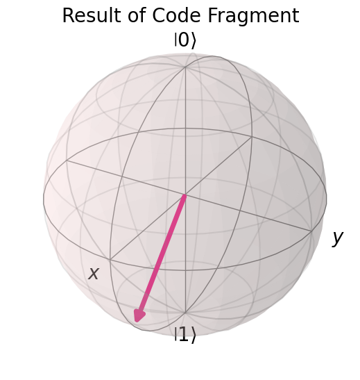
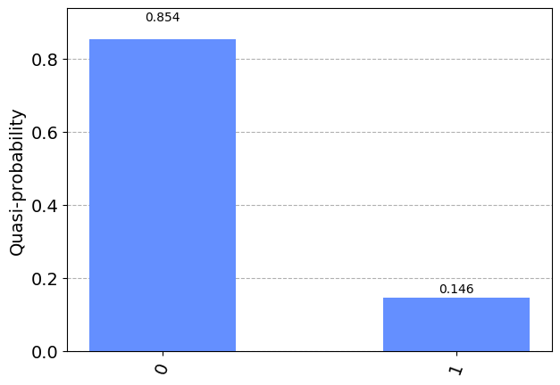
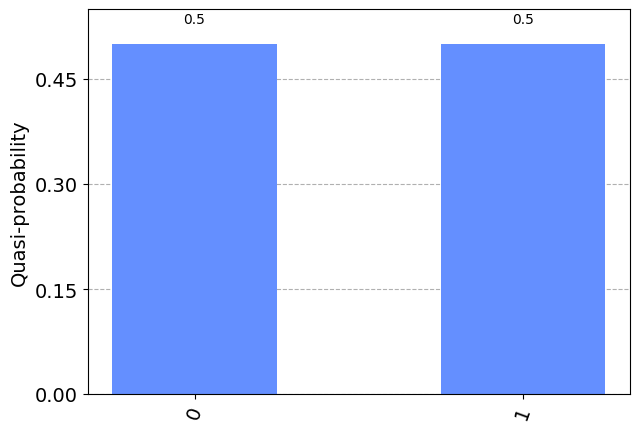
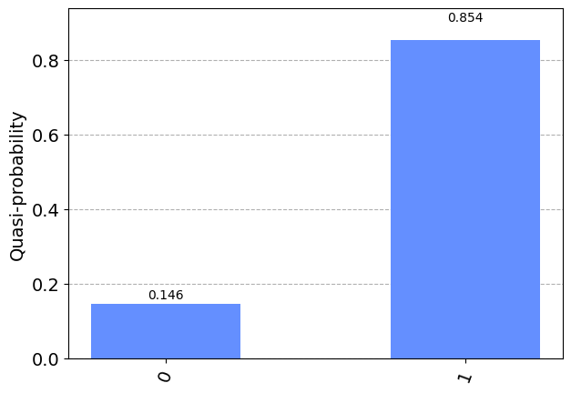
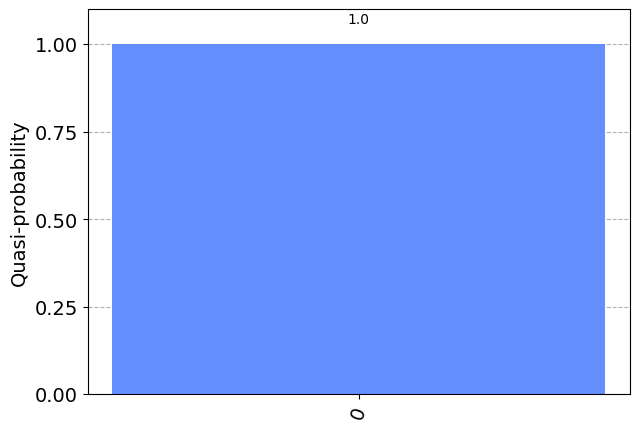

# Question 2

#### Given this code fragment, what is the probability that a measurement would result in $|0
angle$?

    qc = QuantumCircuit(1)
    qc.ry(3 * math.pi/4, 0)

## Answer Options

**A.** 0.8536  
**B.** 0.5  
**C.** 0.1464  
**D.** 1.0

## Question Explanation

This code snippet applies an $R_{Y}$ gate with a $	heta$ of $rac{3\pi}{4}$ to a $|0
angle$ qubit.
This is a rotation along the y axis which brings the Bloch vector to the lower half of the Bloch sphere.


```python
from qiskit.visualization import plot_bloch_vector
from math import pi

bloch_vector = [1, 3 * pi / 4, 0]
plot_bloch_vector(bloch_vector, title="Result of Code Fragment", coord_type="spherical")
```


    

    


## References

[Qiskit QuantumCircuit.ry() API](https://qiskit.org/documentation/stubs/qiskit.circuit.QuantumCircuit.ry.html?highlight=ry#qiskit.circuit.QuantumCircuit.ry)

## Correct Answer

**C.** 0.1464

## Answer Explanations

### Answer A

* 0.8536  

This probability puts the Bloch vector in the top half of the Bloch sphere.
It would require $	heta$ to be less than $rac{\pi}{2}$.
Specifically, this is the probability when $	heta$ is $rac{\pi}{4}$.

#### Let's take a closer look:


```python
import math
from qiskit import QuantumCircuit, Aer
from qiskit.visualization import plot_histogram

# This is the same angle used in the question
theta = math.pi / 4

qc = QuantumCircuit(1)
qc.ry(theta, 0)

plot_histogram(Aer.get_backend("statevector_simulator").run(qc).result().get_counts(qc))
```


    

    


As you can see, for answer A to be correct, $	heta$ would need to be $rac{\pi}{4}$.

### Answer B

* 0.5

This probability puts the Bloch vector halfway between $|0
angle$ and $|1
angle$.
It would require $	heta$ to be $rac{\pi}{2}$.

#### Let's take a closer look:


```python
import math
from qiskit import QuantumCircuit, Aer
from qiskit.visualization import plot_histogram

# This is the same angle used in the question
theta = math.pi / 2

qc = QuantumCircuit(1)
qc.ry(theta, 0)

plot_histogram(Aer.get_backend("statevector_simulator").run(qc).result().get_counts(qc))
```


    

    


As you can see, answer B would require $	heta$ to be $rac{\pi}{2}$.

### Answer C

* 0.1464

This probability puts the Bloch vector in the bottom half of the Bloch sphere.
By process of elimination alone, this is the correct answer.

#### Let's take a closer look:


```python
import math
from qiskit import QuantumCircuit, Aer
from qiskit.visualization import plot_histogram

# This is the same angle used in the question
theta = 3 * math.pi / 4

qc = QuantumCircuit(1)
qc.ry(theta, 0)

plot_histogram(Aer.get_backend("statevector_simulator").run(qc).result().get_counts(qc))
```


    

    


As you can see, when $	heta = rac{3\pi}{4}$, the probability of measuring $|0
angle$ is 0.146.

### Answer D

* 1

This probability has the Bloch vector is at the very top of the Bloch sphere and equals $|0
angle$.
This was the case before we applied an $R_{Y}$ gate. 

#### Let's take a closer look:


```python
import math
from qiskit import QuantumCircuit, Aer
from qiskit.visualization import plot_histogram

# We omit theta altogether

qc = QuantumCircuit(1)
# we do not include any gates

plot_histogram(Aer.get_backend("statevector_simulator").run(qc).result().get_counts(qc))
```


    

    


Now we can add an $R_{Y}$ gate with a $	heta$ of zero, and we will get the same result


```python
theta = 0

qc.ry(theta, 0)

plot_histogram(Aer.get_backend("statevector_simulator").run(qc).result().get_counts(qc))
```


    

    


As you can see, no $R_{Y}$ is necessary to have a probability of 1 that the measurement will result in $|0
angle$.
$	heta = 0$ will also return the same result.
