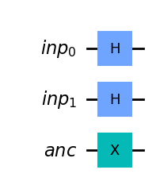
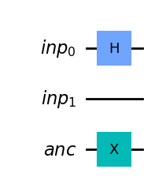
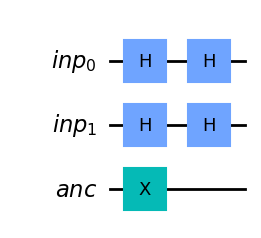

# Question 3

#### Assuming the fragment below, which three code fragments would produce the circuit illustrated? (Select three)

    inp_reg = QuantumRegister(2, name='inp')
    ancilla = QuantumRegister(1, name='anc')
    qc = QuantumCircuit(inp_reg, ancilla)


## Answer Options

**A.**  
    qc.h(inp_reg)  
    qc.x(ancilla)  
    qc.draw()  
**B.**  
    qc.h(inp_reg[0:2])  
    qc.x(ancilla[0])  
    qc.draw()  
**C.**  
    qc.h(inp_reg[0:1])  
    qc.x(ancilla[0])  
    qc.draw()  
**D.**  
    qc.h(inp_reg[0])  
    qc.h(inp_reg[1])  
    qc.x(ancilla[0])  
    qc.draw()  
**E.**  
    qc.h(inp_reg[1])  
    qc.h(inp_reg[2])  
    qc.x(ancilla[1])  
    qc.draw()  
**F.**  
    qc.h(inp_reg)  
    qc.h(inp_reg)  
    qc.x(ancilla)  
    qc.draw()  

## Question Explanation

This important piece to understand from this question is that in Python, the first element of a list has an index of 0.
One must also understand that the notation __[ x : y ]__ mean the numbers will begin at x, and y will be the first index not included in the list.
So [0:3] will be [0, 1, 2] and [4:5] will be [4].


```python
sample = [i for i in range(5)]
print(sample)
print(sample[0:3])
print(sample[4:5])
```

    [0, 1, 2, 3, 4]
    [0, 1, 2]
    [4]


## References

[What's New in Python 2.3 - 15 Extended Slices](https://docs.python.org/2.3/whatsnew/section-slices.html)

## Correct Answer

**A.**  
    qc.h(inp_reg)  
    qc.x(ancilla)  
    qc.draw()  
**B.**  
    qc.h(inp_reg[0:2])  
    qc.x(ancilla[0])  
    qc.draw()  
**D.**  
    qc.h(inp_reg[0])  
    qc.h(inp_reg[1])  
    qc.x(ancilla[0])  
    qc.draw()  

## Answer Explanations

### Answer A

    qc.h(inp_reg)  
    qc.x(ancilla)  
    qc.draw() 

This would apply an $H$ gate to both `inp_reg` qubits and an $X$ gate to the `ancilla` qubit.

#### Let's take a closer look:


```python
from qiskit import QuantumCircuit, QuantumRegister

inp_reg = QuantumRegister(2, name="inp")
ancilla = QuantumRegister(1, name="anc")
qc = QuantumCircuit(inp_reg, ancilla)
qc.h(inp_reg)
qc.x(ancilla)
qc.draw("mpl")
```


    

    


As you can see, answer A results in the correct circuit illustration.

### Answer B

    qc.h(inp_reg[0:2])  
    qc.x(ancilla[0])  
    qc.draw()  

This would apply an $H$ gate to the first two `inp_reg` qubits, and an $X$ gate to the first `ancilla` qubit.

#### Let's take a closer look:


```python
from qiskit import QuantumCircuit, QuantumRegister

inp_reg = QuantumRegister(2, name="inp")
ancilla = QuantumRegister(1, name="anc")
qc = QuantumCircuit(inp_reg, ancilla)
qc.h(inp_reg[0:2])
qc.x(ancilla[0])
qc.draw("mpl")
```


    

    


As you can see, answer B results in the correct circuit illustration.

### Answer C

    qc.h(inp_reg[0:1])  
    qc.x(ancilla[0])  
    qc.draw()  

This would apply an $H$ gate to the first `inp_reg` qubit and an $X$ gate to the first `ancilla` qubit.
However, no gate would be applied to the second `inp_reg` qubit.

#### Let's take a closer look:


```python
from qiskit import QuantumCircuit, QuantumRegister

inp_reg = QuantumRegister(2, name="inp")
ancilla = QuantumRegister(1, name="anc")
qc = QuantumCircuit(inp_reg, ancilla)
qc.h(inp_reg[0:1])
qc.x(ancilla[0])
qc.draw("mpl")
```


    

    


As you can see, the second `inp_reg` qubit has no gate applied and does not match the circuit illustrated.

### Answer D

    qc.h(inp_reg[0])  
    qc.h(inp_reg[1])  
    qc.x(ancilla[0])  
    qc.draw()  

This would apply an $H$ gate to the first `inp_reg` qubit, then an $H$ gate to the second `inp_reg` qubit, and finally an $X$ gate to the first `ancilla` qubit.

#### Let's take a closer look:


```python
from qiskit import QuantumCircuit, QuantumRegister

inp_reg = QuantumRegister(2, name="inp")
ancilla = QuantumRegister(1, name="anc")
qc = QuantumCircuit(inp_reg, ancilla)
qc.h(inp_reg[0])
qc.h(inp_reg[1])
qc.x(ancilla[0])
qc.draw("mpl")
```


    

    


As you can see, answer D results in the correct circuit illustration.

### Answer E

    qc.h(inp_reg[1])  
    qc.h(inp_reg[2])  
    qc.x(ancilla[1])  
    qc.draw()  

This would apply an $H$ gate to the second `inp_reg` qubit, an $H$ gate to a nonexistant third `inp_reg` qubit resulting in an error, and an $X$ gate to the nonexistant second `ancilla` qubit.
This code will result in an error

#### Let's take a closer look:


```python
from qiskit import QuantumCircuit, QuantumRegister

try:
    inp_reg = QuantumRegister(2, name="inp")
    ancilla = QuantumRegister(1, name="anc")
    qc = QuantumCircuit(inp_reg, ancilla)
    qc.h(inp_reg[1])
    qc.h(inp_reg[2])
    qc.x(ancilla[1])
    qc.draw("mpl")
except Exception as e:
    print(f"Error: {e}")
```

    Error: list index out of range


As you can see, answer E results in an error and cannot be run.

### Answer F

    qc.h(inp_reg)  
    qc.h(inp_reg)  
    qc.x(ancilla)  
    qc.draw()  

This would apply two $H$ gates to all of the `inp_reg` qubits, and an $X$ gate to the `ancilla` qubit.

#### Let's take a closer look:


```python
from qiskit import QuantumCircuit, QuantumRegister

inp_reg = QuantumRegister(2, name="inp")
ancilla = QuantumRegister(1, name="anc")
qc = QuantumCircuit(inp_reg, ancilla)
qc.h(inp_reg)
qc.h(inp_reg)
qc.x(ancilla)
qc.draw("mpl")
```


    

    


As you can see, answer F results in a circuit with too many $H$ gates.
