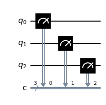

# Question 4

#### Given an empty `QuantumCircuit` object, `qc`, with three qubits and three classical bits, which one of these code fragments would create this circuit?



## Answer Options

**A.** `qc.measure([0,1,2], [0,1,2])`  
**B.** `qc.measure([0,0], [1,1], [2,2])`  
**C.** `qc.measure_all()`  
**D.** `qc.measure(0,1,2)`

## Question Explanation

This question requires knowledge of both the `QuantumCircuit.measure()` method and the `QuantumCircuit.measure_all()` method.
The `measure()` method receives two parameters: an integer or a list with the integers of qubits to be measured, and an integer or a list of integers with the classical bits to receive the measurements.
The `measure_all()` method will measure every qubit, but it will create a new classical bit for each measurement unless passed the parameter `add_bits=False`.

## References

* [Qiskit QuantumCircuit.measure() API](https://qiskit.org/documentation/stubs/qiskit.circuit.QuantumCircuit.measure.html#qiskit.circuit.QuantumCircuit.measure)   
* [Qiskit QuantumCircuit.measure_all() API](https://qiskit.org/documentation/stubs/qiskit.circuit.QuantumCircuit.measure_all.html#qiskit.circuit.QuantumCircuit.measure_all)   

## Correct Answer

**A.** `qc.measure([0,1,2], [0,1,2])`

## Answer Explanations

### Answer A

`qc.measure([0,1,2], [0,1,2])`

This will measure qubit 0 on classical bit 0, qubit 1 on classical bit 1, and qubit 2 on classical bit 2.

#### Let's take a closer look:


```python
from qiskit import QuantumCircuit

qc = QuantumCircuit(3, 3)
qc.measure([0, 1, 2], [0, 1, 2])
qc.draw("mpl")
```

As you can see, answer A creates the correct circuit.

### Answer B

`qc.measure([0,0], [1,1], [2,2])`

This is improper syntax; `measure()` cannot receive three parameters.
This code fragment will result in an error.

#### Let's take a closer look:


```python
from qiskit import QuantumCircuit

try:
    qc = QuantumCircuit(3, 3)
    qc.measure([0, 0], [1, 1], [2, 2])
    qc.draw("mpl")
except Exception as e:
    print(f"Error: {e}")
```

As you can see, answer B raises and error and cannot be run.

### Answer C

`qc.measure_all()`

This will add new classical bits to store the measurements.

#### Let's take a closer look:


```python
from qiskit import QuantumCircuit

qc = QuantumCircuit(3, 3)
qc.measure_all()
qc.draw("mpl")
```

As you can see, answer C generates new classical bits, causing the circuit to be different from the circuit shown in the question.

### Answer D

`qc.measure(0,1,2)`

This is improper syntax; `measure()` cannot receive three parameters.
This code fragment will result in an error.

#### Let's take a closer look:


```python
from qiskit import QuantumCircuit

try:
    qc = QuantumCircuit(3, 3)
    qc.measure(0, 1, 2)
    qc.draw("mpl")
except Exception as e:
    print(f"Error: {e}")
```

As you can see, answer D raises and error and cannot be run.
