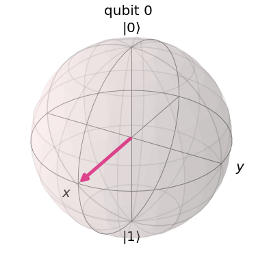
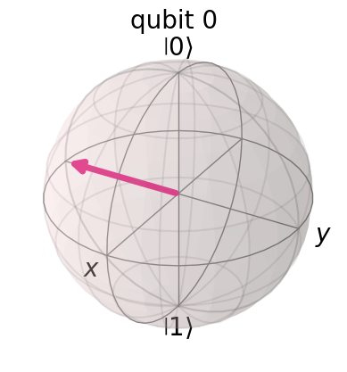
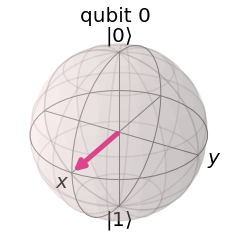
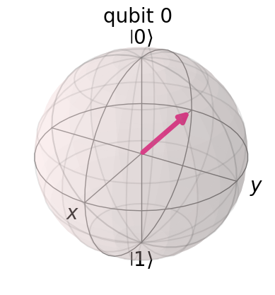
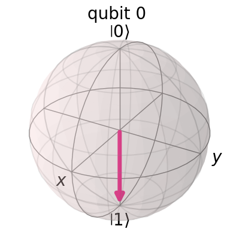

# Question 6

#### Given this code, which two inserted code fragments result in the state vector represented by this Bloch sphere?

    qc = QuantumCircuit(1,1)
    # Insert code fragment here
    simulator = Aer.get_backend('statevector_simulator')
    job = execute(qc, simulator)
    result = job.result()
    outputstate = result.get_statevector(qc)
    plot_bloch_multivector(outputstate)
    


## Answer Options

**A.**  
    `qc.h(0)`  
**B.**  
    `qc.rx(math.pi / 2, 0)`  
**C.**  
    `qc.ry(math.pi / 2, 0)`  
**D.**  
    `qc.rx(math.pi / 2, 0)`  
    `qc.rz(-math.pi / 2, 0)`  
**E.**  
    `qc.ry(math.pi, 0)`

## Question Explanation

This question tests whether on understands the basic gates and the Bloch sphere.

The Hadamard gate performs a rotation of $\pi$ around the $rac{\hat{x} + \hat{z}}{\sqrt{2}}$ axis.
So from the $|0
angle$ state, the $H$ gate is equivalent to an $R_{Y}(rac{\pi}{2})$ gate.
Remember an $R_{\gamma}$ gate will rotate the Bloch vector around the $\gamma$ axis.

## References

* [Qiskit Textbook - Representing Qubit States](https://qiskit.org/textbook/ch-states/representing-qubit-states.html#bloch-sphere)
* [Qiskit Textbook - Single Qubit Gates](https://qiskit.org/textbook/ch-states/single-qubit-gates.html)
* [Qiskit Textbook - More Circuit Identities](https://qiskit.org/textbook/ch-gates/more-circuit-identities.html)

## Correct Answer

**A.** `qc.h(0)`  
**C.** `qc.ry(math.pi / 2, 0)`

## Answer Explanations

### Answer A

`qc.h(0)`

The $H$ gate rotates the Bloch vector halfway from $|0
angle$ to $|1
angle$ around the y axis.

#### Let's take a closer look:


```python
from qiskit import QuantumCircuit, Aer, execute
from qiskit.visualization import plot_bloch_multivector

qc = QuantumCircuit(1, 1)

# Answer's code fragment
qc.h(0)

simulator = Aer.get_backend("statevector_simulator")
job = execute(qc, simulator)
result = job.result()
outputstate = result.get_statevector(qc)
plot_bloch_multivector(outputstate)
```


    

    


As you can see, answer A outputs in the correct Bloch sphere.

### Answer B

`qc.rx(math.pi / 2, 0)`

This code fragment rotates the Bloch vector around the X axis instead of the Y axis.

#### Let's take a closer look:


```python
import math
from qiskit import QuantumCircuit, Aer, execute
from qiskit.visualization import plot_bloch_multivector

qc = QuantumCircuit(1, 1)

# Answer's code fragment
qc.rx(math.pi / 2, 0)

simulator = Aer.get_backend("statevector_simulator")
job = execute(qc, simulator)
result = job.result()
outputstate = result.get_statevector(qc)
plot_bloch_multivector(outputstate)
```


    

    


As you can see, answer B rotates the Bloch vector around the wrong axis.

### Answer C

`qc.ry(math.pi / 2, 0)`

From $|0
angle$, an $R_{Y}\left(rac{\pi}{2}
ight)$ gate is equivalent to an $H$ gate and rotates the Bloch vector halfway from $|0
angle$ to $|1
angle$ around the y axis.

#### Let's take a closer look:


```python
import math
from qiskit import QuantumCircuit, Aer, execute
from qiskit.visualization import plot_bloch_multivector

qc = QuantumCircuit(1, 1)

# Answer's code fragment
qc.ry(math.pi / 2, 0)

simulator = Aer.get_backend("statevector_simulator")
job = execute(qc, simulator)
result = job.result()
outputstate = result.get_statevector(qc)
plot_bloch_multivector(outputstate)
```


    

    


As you can see, answer C outputs in the correct Bloch sphere.

### Answer D

`qc.rx(math.pi / 2, 0)`  
`qc.rz(-math.pi / 2, 0)`

This will first rotate the Bloch vector around the x axis so it lies along the y axis on the xy plane.
The next gate then rotates the vector around the z axis in the wrong direction.

#### Let's take a closer look:


```python
import math
from qiskit import QuantumCircuit, Aer, execute
from qiskit.visualization import plot_bloch_multivector

qc = QuantumCircuit(1, 1)

# Answer's code fragment
qc.rx(math.pi / 2, 0)
qc.rz(-math.pi / 2, 0)

simulator = Aer.get_backend("statevector_simulator")
job = execute(qc, simulator)
result = job.result()
outputstate = result.get_statevector(qc)
plot_bloch_multivector(outputstate)
```


    

    


As you can see, these two rotations move the Bloch vector in the opposite direction of the desired outcome.

### Answer E

`qc.ry(math.pi, 0)`

This would rotate the Bloch vector all the way to $|1
angle$.

#### Let's take a closer look:


```python
import math
from qiskit import QuantumCircuit, Aer, execute
from qiskit.visualization import plot_bloch_multivector

qc = QuantumCircuit(1, 1)

# Answer's code fragment
qc.ry(math.pi, 0)

simulator = Aer.get_backend("statevector_simulator")
job = execute(qc, simulator)
result = job.result()
outputstate = result.get_statevector(qc)
plot_bloch_multivector(outputstate)
```


    

    


As you can see, answer E rotates the Bloch vector too far.
