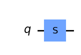
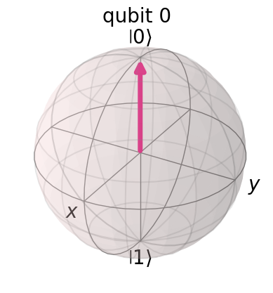
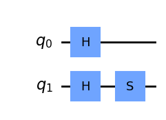
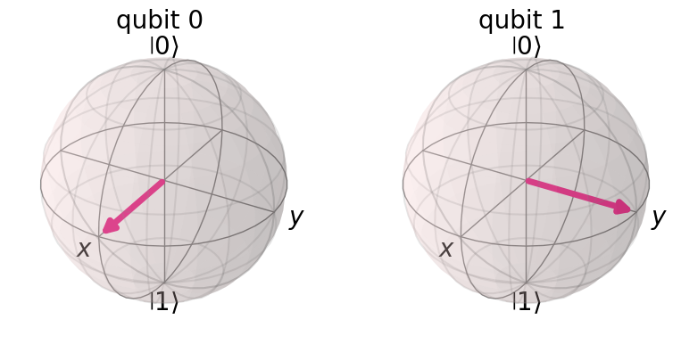

# Question 7

#### S-gate is a Qiskit phase gate with what value of the phase parameter?

## Answer Options

**A.** pi/4     
**B.**  pi/2  
**C.**  pi/8  
**D.**  pi  

## Question Explanation

This question is purely a knowledge check to see if you know what an $S$ gate is.

An $S$ gate is a Clifford gate and a square root of a Pauli-z ($Z$) gate.
It results in a $rac{\pi}{2}$ rotation about the Z axis.

## References

* [Qiskit SGate API](https://qiskit.org/documentation/stubs/qiskit.circuit.library.SGate.html#qiskit.circuit.library.SGate)
* [Qiskit Textbook - Single Qubit Gates](https://qiskit.org/textbook/ch-states/single-qubit-gates.html#6.2-The-S-gates--)

## Correct Answer

**B.** pi/2

## Answer Explanations

Since this is just a knowledge check question, the explanation will focus on showing the impact of an $S$ gate.

#### Let's take a closer look:

First, we will build a circuit with just an $S$ gate.


```python
from qiskit import QuantumCircuit, Aer, execute
from qiskit.visualization import plot_bloch_multivector

qc = QuantumCircuit(1)
qc.s(0)
qc.draw("mpl")
```


    

    


Next, we will plot the Bloch sphere associated with this circuit.


```python
plot_bloch_multivector(
    execute(qc, Aer.get_backend("statevector_simulator")).result().get_statevector(qc)
)
```


    

    


As you can see, there is no affect on the Bloch vector, because rotating around the Z axis does nothing to a vector that lies along the Z axis.
Therefore, we will try this again with an additional gate.


```python
qc = QuantumCircuit(2)
qc.h(0)
qc.h(1)
qc.s(1)
qc.draw("mpl")
```


    

    


This time, we will use two qubits so you can compare the effet of the $S$ gate.
First, the $H$ gate brings the Bloch vector down to the xy plane for both qubits.
Then, the $S$ gate will act upon only the second qubit.


```python
plot_bloch_multivector(
    execute(qc, Aer.get_backend("statevector_simulator")).result().get_statevector(qc)
)
```


    

    


As you can see, the $S$ gate rotated the Bloch vector one quarter turn around the Z axis.
One quarter turn is equivalent to an angle of $rac{\pi}{2}$ radians.
