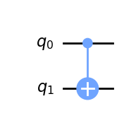
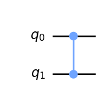

# Question 9

#### Which code fragment will produce a multi-qubit gate other than a CNOT?

## Answer Options

**A.** `qc.cx(0,1)`  
**B.** `qc.cnot(0,1)`  
**C.** `qc.mct([0],1)`  
**D.** `qc.cz(0,1)`

## Question Explanation

For this question, one must be familiar with the different multi-qubit gates that are possible to call on a `QuantumCircuit` in Qiskit.
Specifically, one must understand the multi-qubit controlled-not gates.

## References

* [Qiskit QuantumCircuit API](https://qiskit.org/documentation/stubs/qiskit.circuit.QuantumCircuit.html?highlight=quantumcircuit#qiskit.circuit.QuantumCircuit)   

## Correct Answer

**D.** `qc.cz(0,1)`

## Answer Explanations

### Answer A

`qc.cx(0,1)`

A $CX$ gate is a $CNOT$ gate, since an $X$ gate is also referred to as a $NOT$ gate.

#### Let's take a closer look:


```python
from qiskit import QuantumCircuit

qc = QuantumCircuit(2)
qc.cx(0, 1)
qc.draw("mpl")
```


    

    


As you can see, answer A creates a $CNOT$ gate.

### Answer B

`qc.cnot(0,1)`

This directly applies a $CNOT$ gate.

#### Let's take a closer look:


```python
from qiskit import QuantumCircuit

qc = QuantumCircuit(2)
qc.cnot(0, 1)
qc.draw("mpl")
```


    

    


As you can see, answer B creates a $CNOT$ gate.

### Answer C

`qc.mct([0],1)`

This applies a $CNOT$ gate by applying a multi-control $CNOT$ with the only control qubit being the first qubit.

#### Let's take a closer look:


```python
from qiskit import QuantumCircuit

qc = QuantumCircuit(2)
qc.mct([0], 1)
qc.draw("mpl")
```


    

    


As you can see, answer C creates a $CNOT$ gate.

### Answer D

`qc.cz(0,1)`

This code fragment applies a $CZ$ gate, which is not a $CNOT$ gate.

#### Let's take a closer look:


```python
from qiskit import QuantumCircuit

qc = QuantumCircuit(2)
qc.cz(0, 1)
qc.draw("mpl")
```


    

    


As you can see, by applying a $CZ$ gate, answer D adds a gate that is not a $CNOT$ gate.
