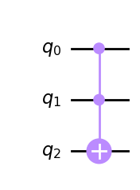

# Question 10

#### Which code fragment will produce a multi-qubit gate other than a Toffoli?

## Answer Options

**A.**

    qc.ccx(0,1,2)
**B.**

    qc.mct([0,1], 2)
**C.**
    
    from qiskit.circuit.library import CXGate
    ccx = CXGate().control()
    qc.append(ccx, [0,1,2])
    
**D.**

    qc.cry(0,1,2)

## Question Explanation

Just like in quesiton 9, one must be familiar with the different multi-qubit gates that are possible to call on a `QuantumCircuit` in Qiskit.
One must also be familiar with a Toffoli gate, which is a $CCX$ gate — an $X$ gate that is controlled by two other qubits.

## References

* [Qiskit QuantumCircuit API](https://qiskit.org/documentation/stubs/qiskit.circuit.QuantumCircuit.html?highlight=quantumcircuit#qiskit.circuit.QuantumCircuit)
* [Qiskit Textbook - The Toffoli](https://learn.qiskit.org/course/ch-gates/basic-circuit-identities#ccx)

## Correct Answer

**D.** `qc.cry(0,1,2)`

## Answer Explanations

### Answer A

`qc.ccx(0,1,2)`

A $CCX$ gate is a Toffoli gate.
This is a $CCX$ gate with qubits 0 and 1 controlling qubit 2.

#### Let's take a closer look:


```python
from qiskit import QuantumCircuit

qc = QuantumCircuit(3)

# Insert code fragment from answer
qc.ccx(0, 1, 2)

qc.draw("mpl")
```


    

    


As you can see, answer A creates a Toffoli gate.

### Answer B

`qc.mct([0,1], 2)`

This adds a multi-bit controlled $X$ gate with two control qubits.
That is identical to a $CCX$ gate, which is a Troffoli.

#### Let's take a closer look:


```python
from qiskit import QuantumCircuit

qc = QuantumCircuit(3)

# Insert code fragment from answer
qc.mct([0, 1], 2)

qc.draw("mpl")
```


    

    


As you can see, answer B creates a Toffoli gate.

### Answer C

`from qiskit.circuit.library import CXGate`  
`ccx = CXGate().control()`  
`qc.append(ccx, [0,1,2])`  

This code fragment adds a $CCX$ gate by importing the Class from the circuit library itself.
By definition, this is a Toffoli.

#### Let's take a closer look:


```python
from qiskit import QuantumCircuit

qc = QuantumCircuit(3)

# Insert code fragment from answer
from qiskit.circuit.library import CXGate

ccx = CXGate().control()
qc.append(ccx, [0, 1, 2])

qc.draw("mpl")
```


    

    


As you can see, answer C creates a Toffoli gate.

### Answer D

`qc.cry(0,1,2)`

This code fragment applies a $CR_{Y}(0)$ gate, which is not a Toffoli.
A $CR_{Y}$ is a controlled $R_{Y}$ gate with a $	heta$ of zero.

#### Let's take a closer look:


```python
from qiskit import QuantumCircuit

qc = QuantumCircuit(3)

# Insert code fragment from answer
qc.cry(0, 1, 2)

qc.draw("mpl")
```


    

    


As you can see, this two-qubit gate is not a Troffoli.
