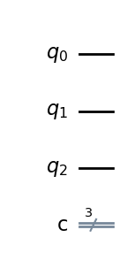
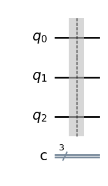

# Question 11

#### Which two options would place a barrier across all qubits to the QuantumCircuit below?

    qc = QuantumCircuit(3,3)


## Answer Options

**A.** `qc.barrier(qc)`  
**B.** `qc.barrier([0,1,2])`  
**C.** `qc.barrier()`  
**D.** `qc.barrier(3)`  
**E.** `qc.barrier_all()`  

## Question Explanation

The `barrier()` method of a `QuantumCircuit` object can take a number of different parameters to specifcy which qubits will receive a barrier.
By passing no parameters, a barrier is drawn across all quabits.
Other valid parameters include a list of the qubits that should receive a barrier or a Python list containing the index of the qubits for which a barrier should be applied.

## References

* [Qiskit QuantumCircuit.barrier() API](https://qiskit.org/documentation/stubs/qiskit.circuit.QuantumCircuit.barrier.html#qiskit.circuit.QuantumCircuit.barrier)

## Correct Answer

**B.** `qc.barrier([0,1,2])`  
**C.** `qc.barrier()`  

## Answer Explanations

### Answer A

`qc.barrier(qc)`  

A `QuantumCircuit` is not a valid parameter to pass to the `barrier()` method, so nothing will happen.

#### Let's take a closer look:


```python
from qiskit import QuantumCircuit

qc = QuantumCircuit(3, 3)

# Insert code fragment from answer
qc.barrier(qc)

qc.draw("mpl")
```


    

    


As you can see, there is no barrier.

### Answer B

`qc.barrier([0,1,2])`  

This code fragment passes a Python list for all the qubits contained in the `QuantumCircuit` qc.
Therefore, this will place a barrier across all qubits in the `QuantumCircuit`.

#### Let's take a closer look:


```python
from qiskit import QuantumCircuit

qc = QuantumCircuit(3, 3)

# Insert code fragment from answer
qc.barrier([0, 1, 2])

qc.draw("mpl")
```


    

    


As you can see, answer B places a barrier across all the qubits.

### Answer C

`qc.barrier()` 

Calling the `barrier()` method on a `QuantumCircuit` object without passing any parameters will place a barrier after all qubits.

#### Let's take a closer look:


```python
from qiskit import QuantumCircuit

qc = QuantumCircuit(3, 3)

# Insert code fragment from answer
qc.barrier()

qc.draw("mpl")
```


    

    


As you can see, answer C places a barrier across all the qubits.

### Answer D

`qc.barrier(3)`

This code fragment passes the index of a nonexistant qubit as a parameter to the  `barrier()` method.
Since there is no fourth qubit, index 3 is out-of-bounds and will raise an error.

#### Let's take a closer look:


```python
from qiskit import QuantumCircuit

qc = QuantumCircuit(3, 3)

try:
    # Insert code fragment from answer
    qc.barrier(3)

    qc.draw("mpl")
except Exception as e:
    print(f"This solution raised the following error: {e}")
```

    This solution raised the following error: 'Index 3 out of range for size 3.'


As you can see, this code fragment riases an error.

### Answer E

`qc.barrier_all()`

There is no `barrier_all()` method, so this method call will throw an error.

#### Let's take a closer look:


```python
from qiskit import QuantumCircuit

qc = QuantumCircuit(3, 3)

try:
    # Insert code fragment from answer
    qc.barrier_all()

    qc.draw("mpl")
except Exception as e:
    print(f"This solution raised the following error: {e}")
```

    This solution raised the following error: 'QuantumCircuit' object has no attribute 'barrier_all'


As you can see, this code fragment riases an error.
