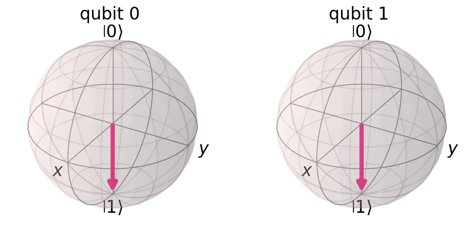
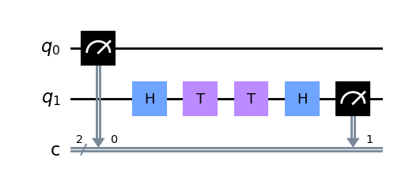
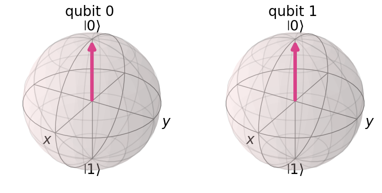
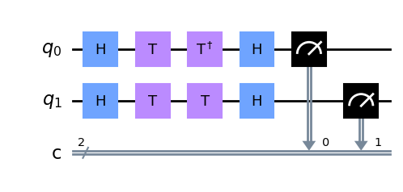
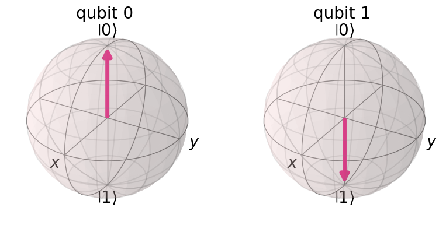
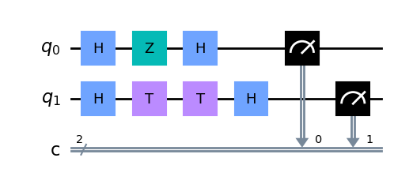
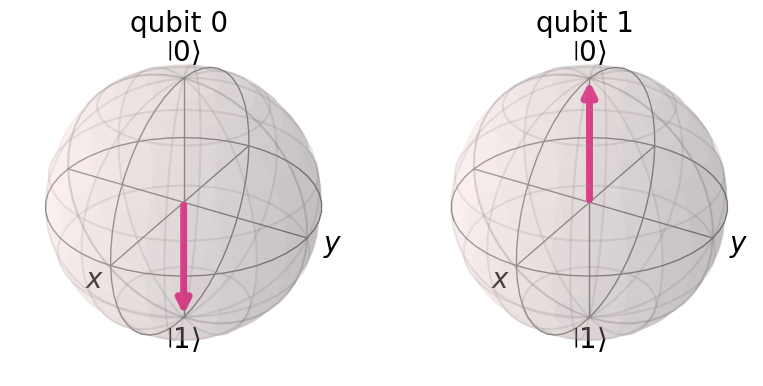

# Question 12

#### What code fragment codes the equivalent circuit if you remove the barrier in the following QuantumCircuit?


## Answer Options

**A.**

    qc = QuantumCircuit(1,1)
    qc.h(0)
    qc.s(0)
    qc.h(0)
    qc.measure(0,0)
**B.**

    qc = QuantumCircuit(1,1)
    qc.measure(0,0)
**C.**

    qc = QuantumCircuit(1,1)
    qc.h(0)
    qc.t(0)
    qc.tdg(0)
    qc.h(0)
    qc.measure(0,0)
**D.** 

    qc = QuantumCircuit(1,1)
    qc.h(0)
    qc.z(0)
    qc.h(0)
    qc.measure(0,0)

## Question Explanation

This question tests your understanding of the definition of several gates and how they affect the qubit's state.
In particular, for this question you need to know that the $T$ gate is equivalent to half of an $S$ gate.
This is because the $T$ gate, sometimes also called a $\sqrt[4]{Z}$ gate, is equivalent to an $R_{Z}(rac{\pi}{8})$ gate.
Meanwhile, an $S$ gate, sometimes called a $\sqrt{Z}$ gate is equivalent to an $R_{Z}(rac{\pi}{4})$ gate.

## References

* [Qiskit Textbook - Single Qubit Gates](https://qiskit.org/textbook/ch-states/single-qubit-gates.html)

## Correct Answer

**A.**

    qc = QuantumCircuit(1,1)
    qc.h(0)
    qc.s(0)
    qc.h(0)
    qc.measure(0,0)

## Answer Explanations

### Answer A

`qc = QuantumCircuit(1,1)`  
`qc.h(0)`  
`qc.s(0)`  
`qc.h(0)`  
`qc.measure(0,0)`  

This creates a circuit that replaces the two $T$ gates from the given `QuantumCircuit` with an $S$.
This is equivalent since two $T$ gates are the same an $S$ gate.

#### Let's take a closer look:


```python
from qiskit import QuantumCircuit, Aer, execute
from qiskit.visualization import plot_bloch_multivector

qc = QuantumCircuit(2, 2)

# Use the answer's code fragment to build the first qubit in this circuit
# qc = QuantumCircuit(1,1) # We built a 2 qubit circuit to compare this to the target
qc.h(0)
qc.s(0)
qc.h(0)
# qc.measure(0,0) # The measurement is moved to a single command at the end of the circuit

# Build the initial circuit without a barrier on the second qubit
qc.h(1)
qc.t(1)
qc.t(1)
qc.h(1)
qc.measure([0, 1], [0, 1])

qc.draw("mpl")
```


    

    


Comparing the gates on the two qubits, we see that the two $T$ gates on the second qubit are replaced with an equivalent $S$ gate on the first qubit.
Next, we can plot the Bloch sphere for each qubit and see they are equivalent.


```python
plot_bloch_multivector(
    execute(qc, Aer.get_backend("statevector_simulator")).result().get_statevector(qc)
)
```


    

    


As you can see, the two circuits are functionally equivalent.

### Answer B

`qc = QuantumCircuit(1,1)`  
`qc.measure(0,0)`

This creates a circuit that is still in the $|0
angle$ state by applying no gates.

#### Let's take a closer look:


```python
from qiskit import QuantumCircuit, Aer, execute
from qiskit.visualization import plot_bloch_multivector

qc = QuantumCircuit(2, 2)

# Use the answer's code fragment to build the first qubit in this circuit
# qc = QuantumCircuit(1,1) # We built a 2 qubit circuit to compare this to the target
qc.measure(0, 0)

# Build the initial circuit without a barrier on the second qubit
qc.h(1)
qc.t(1)
qc.t(1)
qc.h(1)
qc.measure(1, 1)

qc.draw("mpl")
```


    

    


Comparing the gates on the two qubits, we see that the first qubit has no gates applied whil the second quabit has the same gates applied as the given circuit.
Next, we can plot the Bloch sphere for each qubit and see they are not equivalent.


```python
plot_bloch_multivector(
    execute(qc, Aer.get_backend("statevector_simulator")).result().get_statevector(qc)
)
```


    

    


As you can see, the Bloch vectors for each circuit are opposite.

### Answer C

`qc = QuantumCircuit(1,1)`  
`qc.h(0)`  
`qc.t(0)`  
`qc.tdg(0)`  
`qc.h(0)`  
`qc.measure(0,0)`  

This creates a circuit that replaces the second $T$ gates from the given `QuantumCircuit` with an $T\dagger$.
Since $TT\dagger$ is equivalent to Identity $I$, they will negate each other, and this will be equivalent to just applying two $H$ gates

#### Let's take a closer look:


```python
from qiskit import QuantumCircuit, Aer, execute
from qiskit.visualization import plot_bloch_multivector

qc = QuantumCircuit(2, 2)

# Use the answer's code fragment to build the first qubit in this circuit
# qc = QuantumCircuit(1,1) # We built a 2 qubit circuit to compare this to the target
qc.h(0)
qc.t(0)
qc.tdg(0)
qc.h(0)
# qc.measure(0,0) # The measurement is moved to a single command at the end of the circuit

# Build the initial circuit without a barrier on the second qubit
qc.h(1)
qc.t(1)
qc.t(1)
qc.h(1)
qc.measure([0, 1], [0, 1])

qc.draw("mpl")
```


    

    


Next, we can plot the Bloch sphere for each qubit and see whether they are equivalent.


```python
plot_bloch_multivector(
    execute(qc, Aer.get_backend("statevector_simulator")).result().get_statevector(qc)
)
```


    

    


As you can see, the Bloch vectors for each circuit are opposite.

### Answer D

`qc = QuantumCircuit(1,1)`  
`qc.h(0)`  
`qc.z(0)`  
`qc.h(0)`  
`qc.measure(0,0)`

This creates a circuit that replaces the two $T$ gates from the given `QuantumCircuit` with a $Z$.
This is would be the equivalent of replacing two $S$ (sometimes called $\sqrt{Z}$) gates or four $T$ (sometimes called $\sqrt[4]{Z}$) gates.

#### Let's take a closer look:


```python
from qiskit import QuantumCircuit, Aer, execute
from qiskit.visualization import plot_bloch_multivector

qc = QuantumCircuit(2, 2)

# Use the answer's code fragment to build the first qubit in this circuit
# qc = QuantumCircuit(1,1) # We built a 2 qubit circuit to compare this to the target
qc.h(0)
qc.z(0)
qc.h(0)
# qc.measure(0,0) # The measurement is moved to a single command at the end of the circuit

# Build the initial circuit without a barrier on the second qubit
qc.h(1)
qc.t(1)
qc.t(1)
qc.h(1)
qc.measure([0, 1], [0, 1])

qc.draw("mpl")
```


    

    


Comparing the gates on the two qubits, we see that the two $T$ gates on the second qubit are replaced with a $Z$ gate on the first qubit.
Next, we can plot the Bloch sphere for each qubit and see they are equivalent.


```python
plot_bloch_multivector(
    execute(qc, Aer.get_backend("statevector_simulator")).result().get_statevector(qc)
)
```


    

    


As you can see, the Bloch vectors for each circuit are opposite.
