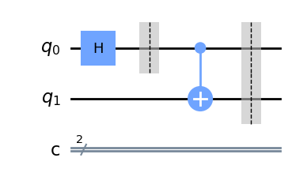
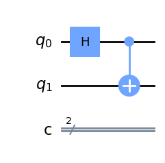

# Question 13

#### Given the following code, what is the depth of the circuit?

    qc = QuantumCircuit(2, 2)

    qc.h(0)
    qc.barrier(0)
    qc.cx(0,1)
    qc.barrier([0,1])

## Answer Options

**A.** 2  
**B.** 3  
**C.** 4  
**D.** 5  

## Question Explanation

According to the Qiskit API, 

>The depth of a quantum circuit is a measure of how many “layers” of quantum gates, executed in parallel, it takes to complete the computation defined by the circuit.

Therefore, the depth of this circuit will be how many gates must be executed along the longest (critical) path across the circuit.

## References

* [Qiskit Quantum Circuits API](https://qiskit.org/documentation/apidoc/circuit.html?highlight=quantum%20circuit%20depth)

## Correct Answer

**A.** 2

## Answer Explanation

Instead of explaining every answer option, this question is best explained by showing the critical path's depth.

First, we build the circuit and draw it so we can see it.


```python
from qiskit import QuantumCircuit

qc = QuantumCircuit(2, 2)

qc.h(0)
qc.barrier(0)
qc.cx(0, 1)
qc.barrier([0, 1])

qc.draw("mpl")
```


    

    


Just in case the barriers serve as a distraction, we can remove them since they do not affect the circuit's execution and do not perform an operation like a gate does.


```python
from qiskit import QuantumCircuit

qc = QuantumCircuit(2, 2)

qc.h(0)
qc.cx(0, 1)

qc.draw("mpl")
```


    

    


Looking at this simplified circuit, we see that the longest (critical) path is across the first qubit, which must execute two gates.
Therefore, the circuit depth is 2, which is answer A.
